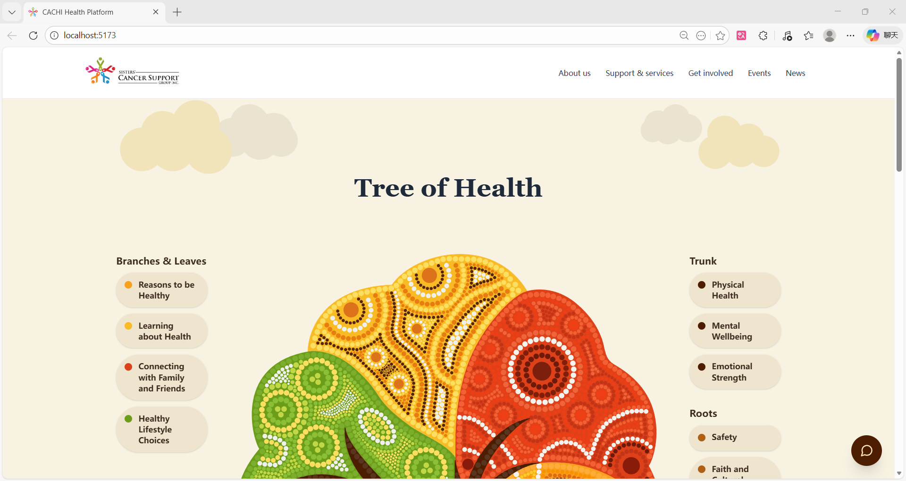
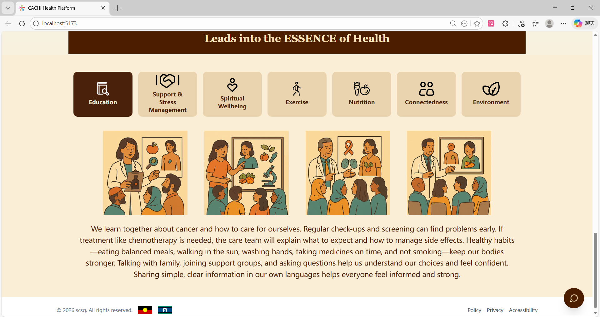
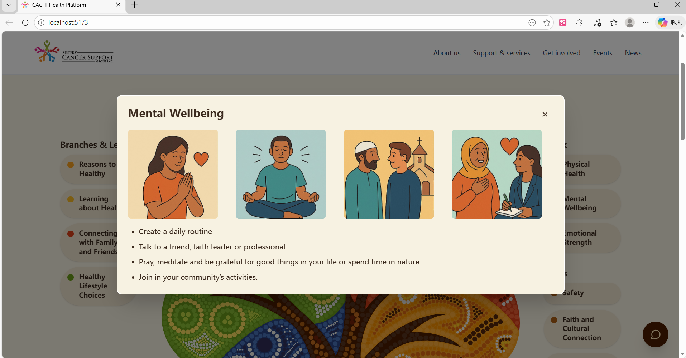
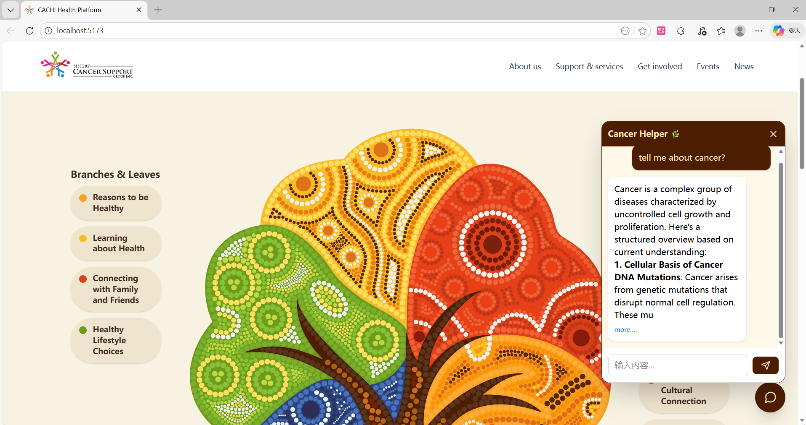

# 🌿 CACHI Health Platform

**CACHI** (Culturally Appropriate Cancer Health Improvement) is a visual-centric digital health platform designed for Culturally and Linguistically Diverse (CALD) communities in Illawarra, Australia.

Developed as a **UOW Capstone Project** in collaboration with the **Sisters Cancer Support Group** and **Multicultural Illawarra**, this platform addresses the health literacy gap for immigrants (specifically Myanmar/Burma and Arabic-speaking populations) who face barriers with traditional text-heavy medical resources.

---

## 🎯 Project Overview

Traditional cancer support resources often fail to resonate with CALD communities due to language barriers, low literacy levels, and a lack of cultural relevance in lifestyle advice.

### Key Solutions:

* **Visual-First Interface**: Minimal text, supported by high-quality imagery, video clips, and audio to accommodate users who may not have completed primary education.
* **AI-Powered Accessibility**: Integrated an **LLM Chatbot** to provide an intuitive, searchable interface for complex health information.
* **Cultural Alignment**: Tailored resources for nutrition, exercise, and spiritual wellbeing that reflect the specific cultural backgrounds of the targeted communities.

---

## 📸 System Screenshots
<p align="left">





---

## ⚙️ Tech Stack

| Category | Technology |
| --- | --- |
| **Framework** | React 18 (Vite) |
| **Styling** | Tailwind CSS |
| **AI Integration** | LLM Chatbot (Backend Integrated) |
| **Icons & Assets** | Custom SVGs & Cultural Iconography |
| **Deployment** | AWS |

---

## 📂 Project Structure

```text
cachi-health-platform/
├── public/
│   ├── icons/                # Category-specific SVGs (Nutrition, Spiritual, etc.)
│   ├── images/               # Massive library of visual aids (4+ images per category)
│   │   ├── mental_wellbeing/ # Targeted visual resources
│   │   ├── physical_health/  # Culturally appropriate exercise visuals
│   │   └── ...               # 15+ other health categories
│   └── logo.png              # Branding assets
├── src/
│   ├── components/
│   │   └── chatbox/          # AI Chatbot UI Components
│   │       ├── ChatWidget.jsx    # Main AI entry point
│   │       ├── ChatFeed.jsx      # Message stream logic
│   │       └── ChatInput.jsx     # User input handling
│   ├── App.jsx               # Application routing & layout
│   ├── treeInteraction.jsx   # Interactive "Tree of Life" navigation logic
│   ├── header.jsx / footer.jsx
│   └── main.jsx              # Entry point
├── index.html                # Main HTML template
├── tailwind.config.js        # Custom styling configurations
└── package.json              # Project dependencies

```

---

## 🌐 Getting Started

### 1. Prerequisites

* Node.js (v18+)
* npm or yarn
* **Backend Support**: This frontend requires the [CACHI Backend](https://github.com/PinocchioHao/cachi-backend) to handle LLM processing.

### 2. Installation

```bash
# Clone the repository
git clone https://github.com/YourUsername/cachi-health-platform.git

# Navigate to the directory
cd cachi-health-platform

# Install dependencies
npm install

```

### 3. Running the App

```bash
# Start the development server
npm run dev

```

The application will be available at `http://localhost:5173`.

---

## 🔗 Related Projects

* **Backend Repository**: [PinocchioHao/cachi-backend](https://github.com/PinocchioHao/cachi-backend) — Spring Boot application handling LLM integration and data persistence.

---